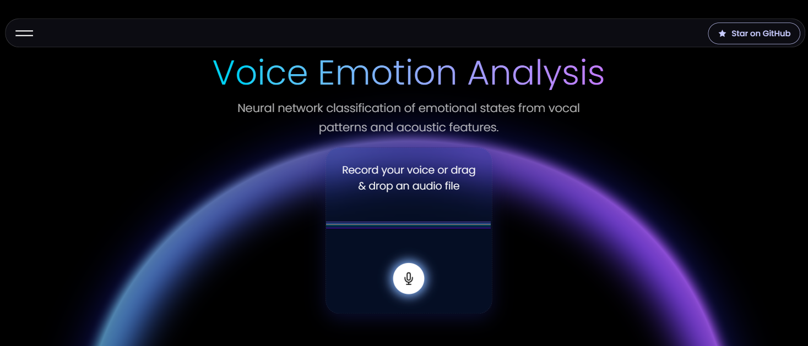

<div align="center">

 # Emotion Recognition from Speech

[](LICENSE)
[](https://www.python.org/)
[](https://huggingface.co/facebook/wav2vec2-base)

<b>Open-source deep learning for robust emotion recognition from raw audio.</b>

</div>

---

## 🚀 Overview

This project explores **emotion recognition from speech** using modern deep learning, including **Wav2Vec2** and classic sequence models. The system listens to short audio clips (4–8 seconds) and predicts the speaker’s emotional state among 8 classes.

**Final model accuracy: ~95%** (multi-corpus, Wav2Vec2, 4s input)

---

## Features

- Emotion classification into 8 classes: Angry, Calm, Disgust, Fearful, Happy, Neutral, Sad, Surprised
- Achieves up to **94.96% accuracy** (4s inputs, multi-dataset)
- Full-stack demo: React frontend + Hugging Face backend API
- Transparent, open-sourced training journey (from 12% → 95%)
- Reproducible experiments, robust feature extraction, and class balancing

---

## Demo

Try the hosted demo: [Live on Vercel](ttps://emotionrecognition.vercel.app)



---

## Training Journey

This project evolved through multiple stages, each milestone improving on the last:

- **v1 (FFNN, MFCC):** ~12% accuracy (no sequence modeling)
- **v2 (LSTM, MFCC):** ~33% accuracy (temporal modeling)
- **v3 (LSTM, log-mel):** ~50% accuracy (better features, dropout)
- **v4 (CRNN, SpecAugment):** ~69% accuracy (CNN+BiLSTM, augmentation)
- **v5 (Wav2Vec2, RAVDESS):** ~85% accuracy (pretrained transformer)
- **v6 (Wav2Vec2, multi-dataset):** ~95% accuracy (multi-corpus, robust)

See [`model/milestones/`](model/milestones/) for the code and results of each stage.

---

## Repository Structure

```bash
emotion_recognition/
│
├── frontend/          # React frontend (Vercel demo)
├── backend/           # FastAPI backend (Hugging Face Space)
├── model/
│   ├── training/      # Training scripts, datasets, feature extraction
│   ├── milestones/    # Model evolution (v1–v6)
│   └── ...
├── README.md          # You are here
└── TRAINING_JOURNEY.md
```

---

## Model & API Links

- [Final Model on Hugging Face ](https://huggingface.co/manelbrh1342/emotion-recognition-model)
- [Backend API Repository](https://huggingface.co/spaces/manelbrh1342/emotion-recognition-app)

---

## Contributing

This is an open-source project — contributions are welcome!

- Fork the repo and submit a pull request
- Open an issue for bugs or feature requests

---

## License

This project is licensed under the MIT License. See the [LICENSE](LICENSE) file for details.